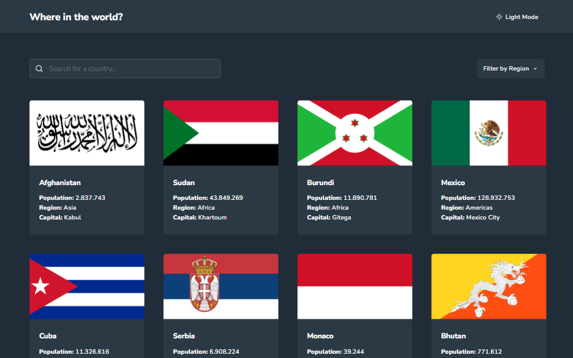
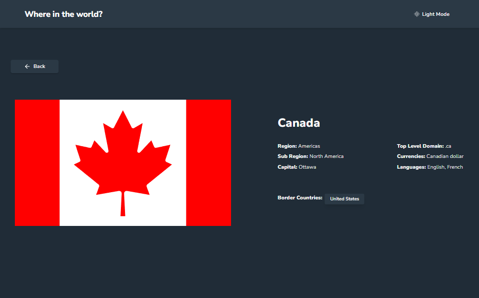

<h1 align="center">Frontend Mentor - REST Countries API with color theme switcher</h1>

## Be Welcome!

Thanks for checking out this front-end coding challenge.

You can check the result through this link: [Profile-Card](https://rest-countries-world.vercel.app)

[Frontend Mentor](https://www.frontendmentor.io) challenges help you improve your coding skills by building realistic projects.

**To do this challenge, you need a advanced understanding of HTML, CSS and Javascript.**

## The challenge

Users should be able to:

- See all countries from the API on the homepage
- Search for a country using an `input` field
- Filter countries by region
- Click on a country to see more detailed information on a separate page
- Click through to the border countries on the detail page
- Toggle the color scheme between light and dark mode *(optional)*

## Links

- Live Site: [Where in the world?](https://rest-countries-world.vercel.app/)
- Countries API: [REST countries](https://restcountries.com/)

## Built with

- [React](https://reactjs.org/) - JS library
- [Next.js](https://nextjs.org/) - React framework
- [Chakra UI](https://chakra-ui.com/) - For structure and styles 
- [React Icons](https://react-icons.github.io/react-icons/) - Library with a great diversity of icons 
- [Axios](https://axios-http.com/docs/intro) - Used to make the request to the api

## Useful resources

- [Dynamic Routes](https://nextjs.org/learn/basics/dynamic-routes) - Next doc about dynamic routes 

## Author

- Frontend Mentor - [@NavarKartalian](https://www.frontendmentor.io/profile/NavarKartalian)
- Linkedin - [Navar Kartalian](https://www.linkedin.com/in/navar-kartalian-784637206/)